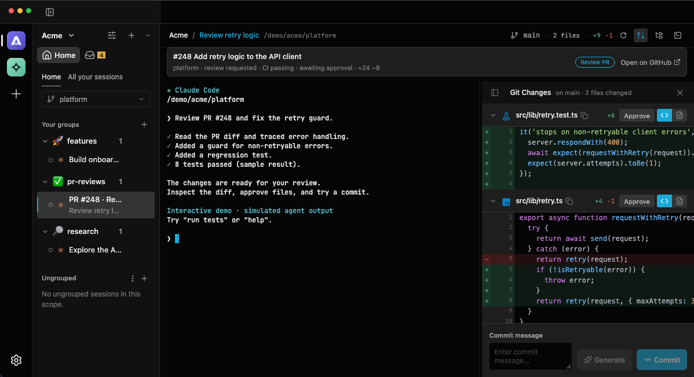
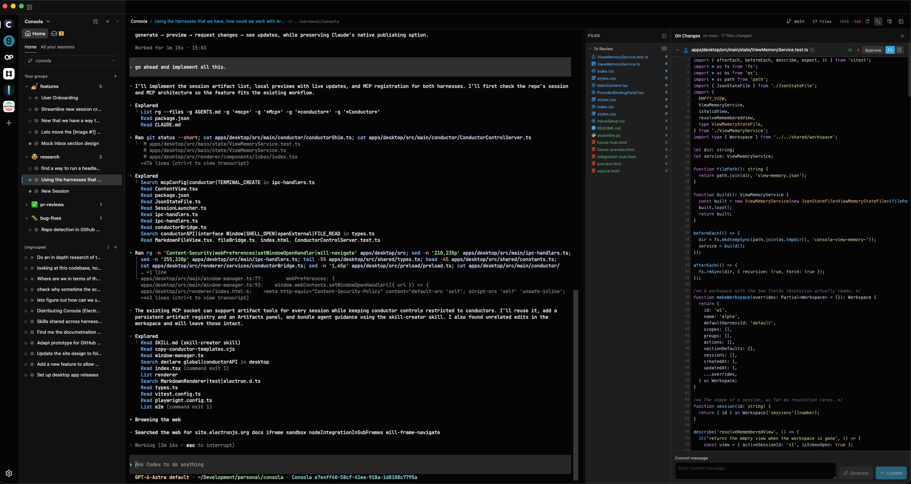

<p align="center">
  <a href="https://www.consola.dev">
    
  </a>
</p>

<h1 align="center">Consola</h1>

<p align="center"><strong>Your agents. Your workflow. One workspace.</strong></p>

<p align="center">
  Keep the power of your terminal. Bring order to everything around it.<br>
  Claude Code, Codex, GitHub, and every thread of work — together in Consola.
</p>

<p align="center">
  <a href="https://www.consola.dev/#download"><strong>Download for macOS</strong></a> ·
  <a href="https://www.consola.dev/#workspace"><strong>Try the live demo</strong></a> ·
  <a href="#getting-started">Getting started</a> ·
  <a href="#development">Build from source</a>
</p>

<p align="center"><sub>Open source · Locally stored · Your actual CLIs · Apple silicon & Intel</sub></p>

[](https://www.consola.dev/#workspace)

<p align="center">
  <strong>Click the preview to make yourself at home.</strong><br>
  <sub>Real interface. Sample data. No sign-in. Agent responses and shell commands are simulated.</sub>
</p>

## Keep every thread of work in reach

Consola is a desktop home for your coding agents. Run your installed Claude Code and Codex CLIs, organize ongoing conversations, and review the resulting code in the same workspace.

| | What you can do |
| :--- | :--- |
| **Separate profiles. Clear head.** | Give each workspace its own GitHub account, repositories, and default harness. Configure separate agent directories to keep work and personal logins and history apart. |
| **Conversations with a place.** | Group sessions by project or purpose, drag them into place, and resume a thread across app restarts. |
| **Room for parallel work.** | Give sessions their own Git worktrees, with a dedicated checkout and shell for each task. |
| **An inbox with a next step.** | Bring GitHub review requests and assigned issues into your workspace. Launch “Review PR” or “Fix CI” with your own prompts and destination groups. |
| **The code, right beside you.** | Browse files, inspect diffs, approve changes, then stage and commit alongside the agent session. |
| **Your CLI, right at home.** | Keep your installed tools, configuration, permissions, and login. Update a CLI and new sessions use that version. |

Workspace settings, session history, and project files live on your machine. Your agents and GitHub connect to their respective services. No Consola account required.

## From “needs your review” to work in motion

1. **Find what needs you.** Open your workspace’s GitHub inbox and pick a pull request or issue.
2. **Give it your playbook.** Choose a saved action to start an agent session with the relevant context, prompt, and conversation group.
3. **Stay close to the code.** Follow the session, inspect file changes, and stage and commit when you’re ready.

**[Try this workflow in your browser →](https://www.consola.dev/#workspace)**

The demo uses the **actual desktop React interface**, backed by fictional projects and in-memory data. Explore Home, switch between Work and Personal, start a sample PR review, type in the terminal, or inspect and commit sample changes. Reset the demo to start fresh. You can also [open the demo full size](https://www.consola.dev/demo/index.html).

<details>
<summary><strong>A look at the real desktop app</strong></summary>



A real desktop capture, separate from the interactive demo’s sample data. [View full size](apps/website/public/assets/consola-screenshot.png).

</details>

## Getting started

### Install Consola

[Download for macOS](https://www.consola.dev/#download), or choose an installer from [GitHub Releases](https://github.com/ConsolaDev/Consola/releases): `arm64.dmg` for Apple silicon, `x64.dmg` for Intel. Drag Consola into Applications.

Bring an installed, signed-in **Claude Code or Codex CLI**. Connect **GitHub CLI (`gh`)** for inbox and PR workflows. Signed macOS distributions can download app updates; choose when to restart, or check manually in **Settings → Updates**.

### Make it yours

1. **Configure your agent.** Open **Settings → Harnesses** to add a Claude Code or Codex configuration. A harness defines which CLI and profile a session uses. Leave the optional fields blank to use your normal installation and login.
2. **Set up a workspace.** Add your repositories, choose its GitHub account, and set a default harness. Use separate harness configuration directories when you want separate agent logins and history.
3. **Start a conversation.** Use **+** or **⌘N** to start with workspace defaults. Use **⌘⇧N** or a group’s **⋯** menu to choose session options, including a Git worktree.
4. **Keep your workflow close.** Create conversation groups and save action prompts for reviews, fixes, research, or whatever you do repeatedly.

<details>
<summary><strong>Session terminals and shortcuts</strong></summary>

Click the **Terminal** icon next to the file explorer button, or press **Ctrl+`**, to open an interactive shell in the session’s directory, including its Git worktree. Drag the divider to resize it. Hide it with the icon, shortcut, or **×** in the header.

Each session has its own shell. Commands keep running when the panel is hidden or another session is active. After `exit`, click **New shell** to start again. Deleting the session or workspace, or quitting Consola, stops its shell; shell processes and output are not restored after an app restart.

**⌘⌥N** opens a new window. On other platforms, Ctrl replaces ⌘ in the session and window shortcuts above.

</details>

## Development

Requires **Node.js 22.12+** and **pnpm 10.28.2** (`corepack enable` enables the pinned package manager).

```sh
git clone https://github.com/ConsolaDev/Consola.git
cd Consola
pnpm install
pnpm dev
```

| Command | Purpose |
| :--- | :--- |
| `pnpm dev` | Run the desktop app with hot reload. |
| `pnpm dev:website` | Run the landing page and interactive demo at localhost:5174. |
| `pnpm build` | Build both apps with Turborepo caching. |
| `pnpm start` | Start the built desktop app. |
| `pnpm test` | Run workspace tests, including the website’s Playwright tests. |
| `pnpm typecheck` | Check TypeScript across workspaces. |
| `pnpm test:e2e` | Build and run desktop Playwright tests. |

```text
apps/
├── desktop/              # Electron app, React UI, native CLI sessions
│   ├── src/main/         # Main process and integrations
│   ├── src/preload/      # Electron IPC bridge
│   ├── src/renderer/     # Shared source for the desktop UI and browser demo
│   ├── src/shared/       # Types and constants
│   └── tests/            # Desktop E2E tests and fixtures
└── website/              # Vite landing page and download page
    ├── src/              # Landing page styles and behavior
    ├── demo/             # Real app renderer, mock APIs, and sample data
    └── public/assets/    # Shared README and website images
```

Use `pnpm --filter consola <script>` or `pnpm --filter @consola/website <script>` to work on one app. Add dependencies to their owning workspace with `pnpm --filter <package> add <dependency>`.

<details>
<summary><strong>Testing and packaging</strong></summary>

Desktop E2E tests run with hidden Electron windows by default. Use `CONSOLA_E2E_HEADED=1 pnpm test:e2e` to show them while debugging. Traces and failure screenshots are available in either mode. Linux CI needs a display such as Xvfb.

The website tests use Playwright Chromium; install it with `pnpm --filter @consola/website exec playwright install chromium`, or use `PLAYWRIGHT_CHANNEL=chrome` with a local Chrome installation. See the [website development guide](apps/website/README.md#development-and-verification) for focused checks.

Desktop builds go to `apps/desktop/dist`, installers to `apps/desktop/release`, and website output to `apps/website/dist`. See the [desktop release workflow](.github/workflows/release.yml) for signed installers and update publishing.

Local implementation plans, research, and design mockups belong in the ignored root `docs/` folder.

</details>

### One interface, from desktop to demo to README

The browser demo imports the desktop renderer directly. Changes to the app’s components and styles appear in the next website build; sample content and simulated Electron APIs live in `apps/website/demo/`.

The clickable preview at the top of this README and the website’s social previews share **one screenshot**, captured from that demo. To refresh it after UI or fixture changes, run the website in one terminal:

```sh
pnpm dev:website
```

Then capture the preview in another:

```sh
pnpm --filter @consola/website capture:demo
# With a local Chrome installation:
# PLAYWRIGHT_CHANNEL=chrome pnpm --filter @consola/website capture:demo
```

Commit the updated `apps/website/public/assets/consola-demo.png` with your changes. GitHub displays the static image and links to the live experience; the interactive demo runs on the website. The [website guide](apps/website/README.md#interactive-demo) covers fixtures, mock APIs, and preview metadata.

## Contributing

Found a rough edge or have a workflow you’d love to see? [Open an issue](https://github.com/ConsolaDev/Consola/issues), try a change locally, or send a pull request. For UI changes, explore the browser demo as well as the desktop app and refresh the shared preview when needed.

## License

ISC
