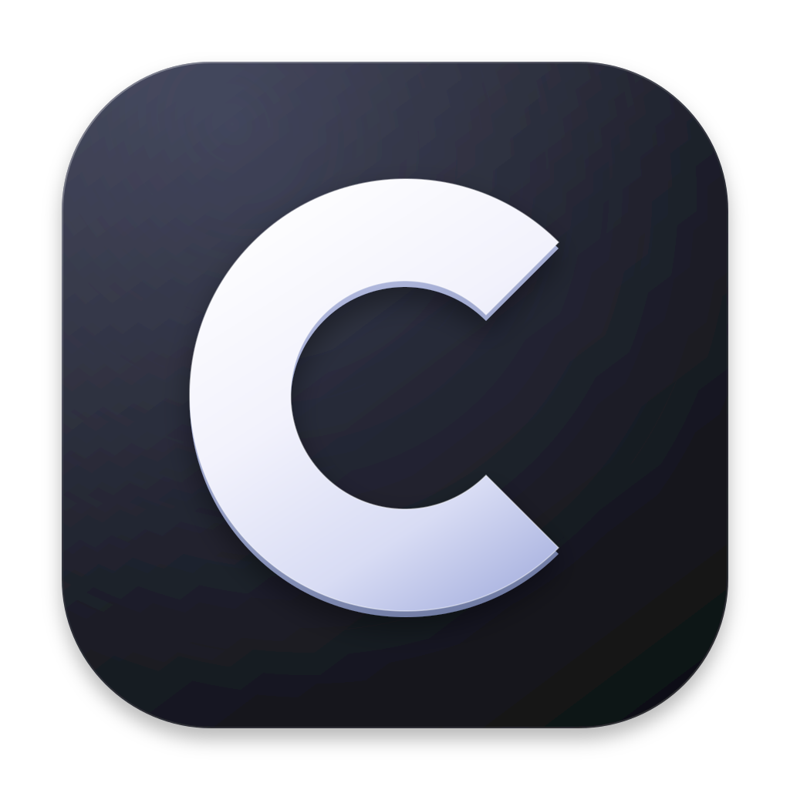
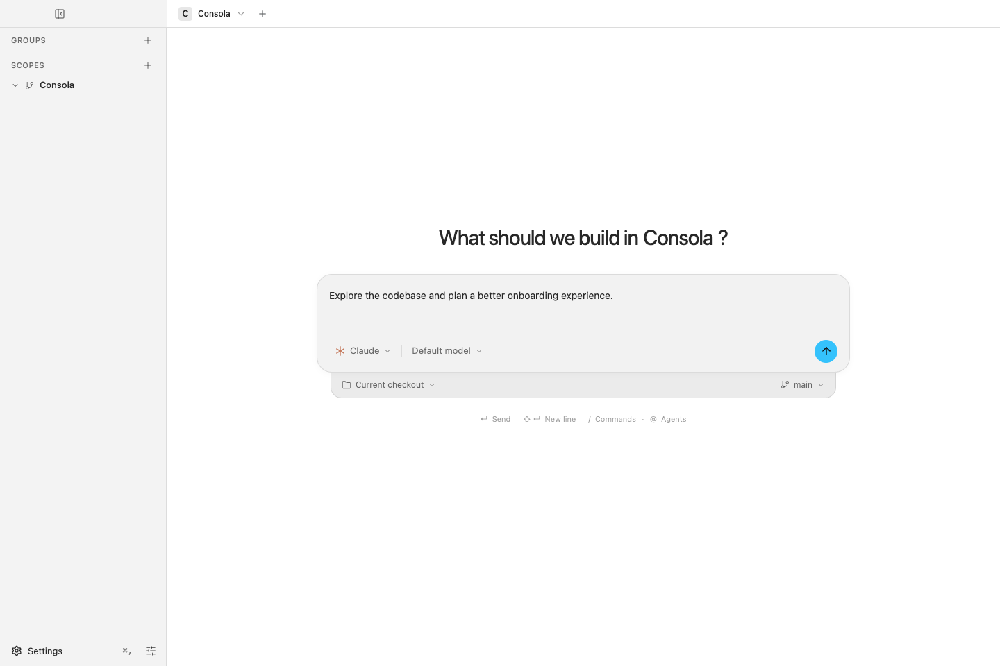

<p align="center">
  
</p>

<h1 align="center">Consola</h1>

<p align="center"><strong>Big ideas. One command center.</strong></p>

<p align="center">
  A home for your coding agents. Bring Claude Code, Codex, projects, and Git review together in one desktop app.
</p>

<p align="center">
  <a href="#getting-started">Getting started</a> ·
  <a href="#features">Features</a> ·
  <a href="#development">Development</a>
</p>



<p align="center"><sub>A new conversation in Consola, with agent selection and Git checkout controls.</sub></p>

## What is Consola?

Consola is an Electron desktop application for working with Claude Code and Codex. Organize projects into workspaces, keep resumable agent sessions together, and review code alongside your conversations. For structured development, Consola supports the **RPI methodology** (Research, Plan, Implement):

1. **Research** - Explore your codebase, understand existing patterns, and document findings
2. **Plan** - Create detailed implementation plans with clear success criteria
3. **Implement** - Execute plans with AI assistance, tracking progress against your plan

## Features

- **Multi-workspace Support** - Organize projects into workspaces for better context management
- **Tab-based Interface** - Work on multiple projects simultaneously
- **Claude Code Integration** - Runs the `claude` CLI itself, so every feature it ships is available as-is
- **Codex Harness** - Add OpenAI's Codex CLI in Settings → Harnesses and select it for new sessions
- **Session Terminals** - Open a normal shell alongside each agent, rooted in its checkout, with output and running commands preserved while switching sessions
- **Resumable Sessions** - Each tab keeps its conversation across restarts
- **Issue Tracker Integration** - Native sync with Linear and other project management tools
- **File Explorer & Git Review** - Browse files, review diffs, and stage and commit alongside the session
- **Dark/Light Themes** - Automatic system theme detection with manual override

## Getting Started

### Prerequisites

- Node.js 18+
- npm or yarn
- Claude API access (via Claude Code CLI)

### Installation

```bash
# Clone the repository
git clone https://github.com/ConsolaDev/Consola.git
cd Consola

# Install dependencies
npm install

# Start development server
npm run dev
```

### Building for Production

```bash
# Build all components
npm run build

# Start the production app
npm start
```

### Using Codex

Install and sign in to the Codex CLI, then open **Settings → Harnesses → Add
harness** and select **Codex**. Give it a name and leave the configuration fields
blank to use your normal installation and login. You can also set an explicit
binary path or a separate `CODEX_HOME` directory for another profile.

Select the harness when creating a session or set it as the workspace default.
Conversations resume across app restarts. Use Codex's `/model` menu or a harness
launch argument such as `--model <model>` to choose a model. Codex autocomplete
and automatic tab naming are not yet available in Consola's composer.

The integration requires a CLI supporting `app-server`, `thread/start`,
`thread/name/set`, and `thread/resume`. Update Codex if your CLI lacks these
methods. Consola keeps conversation ID mappings in `CODEX_HOME/consola/sessions`;
retain that folder alongside the profile's history when moving a profile.

### Running shell commands

Click the **Terminal** icon next to the file explorer button, or press **Ctrl+`**,
to open your normal interactive
shell in that session's directory (including its Git worktree). Drag the divider
to resize it; use the icon, shortcut, or **×** in the terminal header to hide it. Each session has its own shell,
and commands keep running while the panel is hidden or another session is active.
The panel shows the shell's starting directory; use `pwd` to see your current
location after `cd`.

The shell runs independently of the coding agent. After `exit`, click **New
shell** to start again. Deleting the session or its workspace, or quitting
Consola, stops its shell. Shell processes and output are not restored after an
app restart.

## Development

### Project Structure

```
src/
├── main/           # Electron main process
├── preload/        # Preload scripts for IPC
├── renderer/       # React frontend
│   ├── components/ # UI components
│   ├── hooks/      # Custom React hooks
│   ├── stores/     # Zustand state management
│   └── services/   # API and bridge services
└── shared/         # Shared types and constants
```

### Scripts

- `npm run dev` - Start development server with hot reload
- `npm run build` - Build for production
- `npm run build:main` - Build main process only
- `npm run build:renderer` - Build renderer only
- `npm run test:e2e` - Run Playwright E2E tests

## The RPI Methodology

The Research-Plan-Implement methodology brings engineering rigor to AI-assisted development:

### Research Phase
- Use `/research-codebase` to explore and document existing code
- Understand patterns, conventions, and architecture before making changes
- Generate research documents that persist as project knowledge

### Plan Phase
- Use `/create-plan` to design implementation strategies
- Break down work into trackable tasks with clear success criteria
- Review and iterate plans before writing code

### Implement Phase
- Use `/implement-plan` to execute plans with AI assistance
- Track progress against plan milestones
- Validate implementation against success criteria

## License

ISC
