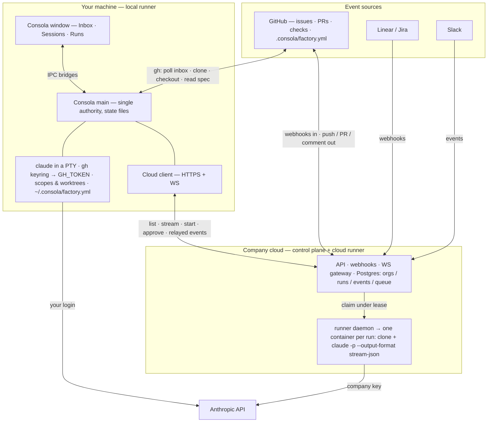
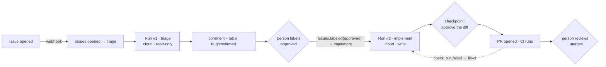

# Consola Factories — North Star

**Status:** direction, not a spec. Nothing in this document is implemented.
**Last updated:** 2026-08-27
**Companion:** interactive overview with diagrams and mockups —
https://claude.ai/code/artifact/2b05a5b5-ca41-4b15-94a4-4f7204e6860d (private artifact)
**Sources:** `research/2026-08-25-cloud-management-local-coupling-map.md`,
`research/2026-08-18-agent-deck-conductor-listeners-actions.md`,
`docs/superpowers/specs/2026-08-25-inbox-actions-and-provider-seam-design.md`,
the fleetwide repo (`~/Development/personal/fleetwide`), warp.dev/factories.

## How to use this document

This is where Consola is heading: spec-driven agent automations — bug triage,
ticket-to-PR, Slack-driven work — that run **locally in Consola as you** and
**in the cloud as the company**, from one vocabulary. When building any feature
that touches sessions-as-runs, actions, triggers, the cloud, spec files, or
identity, read §2 (invariants) and §5 (decisions) first. They are the things
that decide details. §8 (deferred) lists where we are going so that nothing
built now precludes it.

Specs and plans for individual slices live in `docs/superpowers/`; this
document does not replace them. When a spec contradicts this document, either
the spec is wrong or this document needs updating — decide which, explicitly.

---

## 1. The aim

Warp's "cloud software factory" loop — triage → spec → implement → verify →
ship → monitor, with a person reviewing the spec, the code and the product —
built on what Consola already is: a thin coordinator of CLIs that owns the
workspace while the CLI owns the conversation.

Two audiences, one product:

- **A person at their machine.** Consola today, plus automations that are
  theirs: "when GitHub asks me for a review, notify me and start my review
  session here."
- **A company.** Automations that survive a laptop closing, act as a bot,
  spend from a budget somebody can see, and leave an audit trail — self-hosted
  first, hosted later.

Warp's layers mapped onto ours:

| Warp | Ours |
|---|---|
| Terminal | Consola |
| Factories | `factory.yml` + Automations |
| Integrations | GitHub App webhooks, Slack, Linear on the cloud side; `gh` polling locally |
| CLI / API / SDK | The cloud API (HTTP + WS) is the contract; Consola and the web app are clients |
| Agent configuration | Harness (local) / Environment image (cloud); `Action.tools` for permissions |
| Orchestration | Automation = trigger → action → runner, with a mode and a checkpoint |
| Administration | `Run.cost`, `Run.attribution`, `orgId`, audit log — recorded now, rendered later |
| Hosting | Self-hosted Docker + Postgres; hybrid and hosted tiers reuse the same images |
| Multi-harness | `HarnessDriver` seam on both runners |
| Multi-agent | Automations *are* the triage/implementor agents; a conductor is optional judgement on top |
| Data plane | Run artifacts (diff, PR, transcript, log) in the cloud; rules and skills in the repo |

---

## 2. Invariants

These are non-negotiable unless this document changes. Each one has decided a
detail already and will decide more.

1. **One vocabulary, two runners.** Action, Automation, Trigger, Run,
   Environment are defined once (§3). Exactly two things execute a Run today:
   the **local runner** (Consola's main process) and the **cloud runner**
   (a container per run). The `runner` field is an enum that may grow
   (e.g. Anthropic-hosted); nothing may assume it has two values.
   Everything above the runner is runner-agnostic.
2. **The CLI owns the conversation — in the cloud too.** A cloud run is
   `claude -p` inside the container, not a re-implemented agent loop. Skills,
   `CLAUDE.md`, hooks, plugins and MCP behave identically in both runners.
   Consola's `HarnessDriver` seam (binary + config dir + extra args) describes
   a cloud harness as well as a local one; nothing outside a driver branches
   on a driver id.
3. **Credentials never cross the seam. Ownership decides identity; identity
   decides the runner.** Local runs use identities Consola never stores (your
   `claude` login, your `gh` keyring). Cloud runs use identities the company
   owns (API key, GitHub App). A company automation runs in the cloud as the
   bot (locally, as you, only for `on: manual`). A personal automation runs
   only locally, as you; `runner: cloud` on a personal record is rejected.
   Personal subscription logins never run on cloud runners.
4. **The spec is a file.** Company automations live in `factory.yml` in the
   org repo (`<org>/.consola`) and/or the repo (`.consola/factory.yml`),
   reviewed by PR. Personal automations live in `~/.consola/factory.yml`.
   Same schema, validated by one package. Secrets, account bindings, URLs and
   cost history are never in the file.
5. **No workflow engine.** The issue tracker is the state machine: automations
   chain through labels and states, and every human checkpoint is a state a
   person changes — which is itself the next trigger. No run ever calls the
   next run. A DAG engine, if ever needed, sits on top of Run records.
6. **The control plane never starts a container. A run is a row.** Webhooks
   insert a `queued` Run and return; a worker (in-process at first, a runner
   daemon later) claims it under a lease from a Postgres queue and starts the
   container. Events are written to Postgres before they are pushed over a
   WebSocket; late joiners replay from storage.
7. **Record now, render later.** `Run.cost`, `Run.attribution`, `orgId` on
   every cloud row, an append-only audit log, the action's version hash — all
   present from the first slice, even with one org and no dashboard.
8. **Local works offline. The cloud is a mirror and an event bus, never a
   dependency.** Consola with the cloud disconnected is today's Consola plus
   personal automations. Profile sync (deferred) mirrors portable state; it
   does not own it.
9. **Confirm by default for anything a person did not click.** Modes are
   `auto`, `confirm` (notification with a Run button), `notify`. Triggered
   automations default to `confirm`; write actions on the cloud get a
   `preview` checkpoint before a PR opens.
10. **Consola's existing invariants carry over unchanged:** never type into a
    confirmation menu; main is the single authority and renderers send
    intents over bridges; zero stored credentials (the cloud API token in
    `safeStorage` is the deliberate first exception); harnesses are archived,
    never deleted; a session's harness and model are immutable; "terminals
    outlive their views" gains "…and can be born without one".

---

## 3. Vocabulary

| Noun | Meaning | Exists today as |
|---|---|---|
| **Environment** | Where a run executes: locally a scope + harness; in the cloud an image + setup commands + env + mounted repos. | Consola `Scope` + `Harness`; fleetwide `Workspace` |
| **Action** | A named recipe: prompt template, `applies_to` (issue, PR, free text), `tools` (read-only / write → CLI permission flags). Skills ride inside the prompt as `/skill`. | Consola `WorkItemAction` (Inbox v2) |
| **Trigger** | An event pattern: `github: issues.opened`, `github: issues.labeled(approved)`, `slack: mention(#chan)`, `linear: issue.created(team)`, `cloud: run.finished(automation)`, `session: finished`, `cron`, `manual`. | Inbox rows (manual) |
| **Automation** | Trigger → Action, on a runner, with `mode`, optional `checkpoint`, optional `budget`, a `repos`/`workspace` selector, and a `source` (`org` / `repo` / `personal`). | New (Layer 3 of the 2026-08-18 research, generalised) |
| **Run** | One execution: provenance, status timeline, artifacts, cost, attribution. | Consola `Session` (partly); fleetwide `Session` (partly) |
| **Runner** | Turns a Run into a process: `local` or `cloud`. The only place the two differ in code. | `TerminalManager`; `SessionOrchestrator` |
| **Track** | One unit of work across systems: anchored on a ticket (`ItemRef` = `{provider, type, key}`), with PRs, Slack threads, sessions and runs attached by rule or by hand; stage derived, never stored. The session is the actor; Consola only links and hands over context. | `Session.workItem` (one item, one session). Detail: `research/2026-08-27-tracks-connections-integration-manifests.md` |
| **Connection** | One integration on a workspace: the vendor's CLI (preferred: `gh`, `acli`) or MCP for acting, a declarative feed manifest, correlation rules, a credential reference when no CLI keyring exists. Manifests are user-/org-extensible YAML. | `Workspace.provider` (GitHub only). Detail: same research doc |
| **Plugin** | A bundle extending the app layer: data floor (integration manifests, action templates, declarative views) + optional code in a sandboxed plugin host contributing to fixed slots (views, badges, detail sections, tools, sinks; kit panels in Phase 2). One item surface: all views render in the Inbox; Apps panels are non-item only; plugins extend the factory, never run their own loops. | — (new). Detail: `research/2026-08-27-plugin-system-design.md` |

Deliberate omissions: no **Workflow** noun (invariant 5); no **Agent** noun
distinct from Action — Warp's "triage agent" is an action with a prompt and
tool permissions, and its harness is the environment's business.

### Run record (shape, not schema)

```ts
interface Run {
  id: string;
  orgId?: string;                       // always set on cloud rows
  runner: 'local' | 'cloud';
  source: 'org' | 'repo' | 'personal' | 'manual';
  automationId?: string;
  actionName: string;                   // snapshot at launch, like Session.workItemAction
  actionVersion: string;                // hash of prompt + tools; for evals later
  trigger: { kind: string; ref: string; eventId: string; actorId?: string };
  environment: { scopeId?: string; workspaceId?: string; image?: string };
  status: 'queued' | 'starting' | 'setup' | 'running' | 'needs-approval'
        | 'preview' | 'approved' | 'rejected' | 'completed' | 'failed' | 'expired';
  artifacts: { branch?: string; prUrl?: string; diffSummary?: unknown;
               commentUrl?: string; transcriptRef?: string };
  cost?: { inputTokens: number; outputTokens: number; cacheRead: number; usd: number };
  attribution: { orgId?: string; workspaceId?: string; automationId?: string;
                 actionName: string; triggerKind: string; actorId?: string };
  createdAt: string; updatedAt: string;
}
```

On the cloud side this is fleetwide's `sessions` table extended, not a new
table. On the local side Consola mirrors the shape for sessions started from
an action.

---

## 4. Architecture

### 4.1 Topology



The two sides share nothing at runtime. GitHub is the one system both reach;
the repo's `factory.yml` is how one spec drives both. The cloud client lives
in Consola's main process, not the renderer.

### 4.2 Local runner (Consola)

- Starts sessions through the existing machinery: `SessionLauncher`,
  `TerminalManager.startHeadless`, the prompt FIFO behind the delivery guard,
  `terminal:status` events, groups, OS notifications (Phase 2 — Fleet).
- Reads `.consola/factory.yml` from each scope and `~/.consola/factory.yml`;
  merges actions into the workspace's action list tagged by source; shows
  company automations read-only and personal ones editable.
- Local event sources (only while Consola is open — "offline honesty"):
  - `github: review_requested / assigned / mentioned / ci_failed` — derived
    from the existing Inbox poll (`gh api graphql`, 3 min + on focus); a new
    item in a section is an event. Optionally `gh api /notifications` (needs
    the `notifications` scope).
  - `session: finished / needs-attention` — the existing `terminal:status`.
  - `cloud: run.finished / run.needs_approval` — relayed over the cloud
    client's WebSocket when connected.
  - `cron` — a main-process timer. `slack: mention` — Socket Mode, later.
  - Dedupe: main-process seen-set keyed `(source, eventId)`; enabling a trigger
    marks the current Inbox as seen. Settings show "listening since / last
    event" per trigger.
- Every session started from an action gets a Run row; the Runs view lists
  local and cloud rows together with the runner badge and trigger text.
- The cloud client (`FleetwideClient` in main, `runsBridge` in the renderer)
  holds the one credential Consola keeps: the org-scoped API token, in
  `safeStorage`.

### 4.3 Cloud runner and control plane

- **Control plane:** stateless API replicas; Postgres for orgs, runs, events,
  queue (`SELECT … FOR UPDATE SKIP LOCKED`), audit; webhook receivers (GitHub
  App with signature verification and delivery-id dedupe, Slack, Linear);
  cron; org-scoped API tokens verified by a guard on HTTP and on WS
  `subscribe`; later an Anthropic gateway (per-org key, metering, budget).
- **Runner daemon:** connects outbound (no inbound ports in a customer VPC),
  claims runs under a lease renewed by heartbeat, advertises free slots,
  starts a container from the environment image, clones with an App
  installation token, runs `claude -p`, writes stream-json lines to
  `run_events`, finalises (commit → push `…/run-{id}` branch → diff →
  `preview`), destroys the container. In-process worker loop first; separate
  image later — same code behind the same port.
- **Queue semantics:** per-org fair share; caps `orgs.max_concurrent_runs`
  and pool capacity; lost lease → `failed (runner lost)` for write actions
  (never silently re-run), optional re-queue for read-only.
- **Isolation is a pool property:** plain Docker when every run on a host
  belongs to one org; a microVM per run (Firecracker, or gVisor/Kata on
  Kubernetes) for shared hosted pools. A `ContainerBackend` port (Docker |
  Kubernetes | microVM) keeps this a runner choice.
- **Sizing:** ~1–2 GB and ½–1 vCPU per run, 2–10 min each; ~25–40 concurrent
  runs per 64 GB host. A few hundred runs a day peaks at 20–30 concurrent.
- **Deployment tiers:** one VM via `docker compose` (solo/small); API + DB +
  N runner VMs (company); hosted control plane + runners in the customer's
  VPC (hybrid); hosted multi-tenant with autoscaled microVM pools. Same three
  images (api, web, runner) + Postgres in every tier.

### 4.4 Spec files and resolution

```yaml
# <org>/.consola/factory.yml — org level, reviewed by PR
version: 1
environments:
  node:   { image: ghcr.io/acme/dev:node22, setup: [pnpm i --frozen-lockfile] }
defaults: { runner: cloud, mode: confirm, budget: { usd_per_run: 3 } }
actions:
  triage:    { applies_to: [issue], tools: read-only, prompt: "..." }
  implement: { applies_to: [issue], tools: write,     prompt: "/implement {{url}}" }
automations:
  - name: triage-new-issues
    repos: { topics: [service] }        # selector: topics, list, or glob
    on: { github: issues.opened }
    run: triage
    mode: auto
  - name: implement-approved
    repos: "acme/*-service"
    on: { github: issues.labeled, label: approved }
    run: implement
    checkpoint: preview
```

```yaml
# <repo>/.consola/factory.yml — optional; repo wins on conflict
environment: node
disable: [implement-approved]
actions:
  triage: { prompt: "...repo-specific..." }
```

```yaml
# ~/.consola/factory.yml — personal; local runner only
version: 1
automations:
  - name: review-requests
    workspace: Acme
    on: { github: review_requested }
    run: Review
    mode: confirm
    group: Reviews
  - name: bot-implemented
    repos: "acme/*"
    on: { cloud: run.finished, automation: implement-approved }
    run: Review
    mode: confirm
```

- Resolution order: `org ⊕ repo` (repo wins, `disable` removes) for company
  automations; the personal file is a separate set, never merged into the
  company one. The cloud API resolves on push to either file, expands `repos`
  selectors through the App's installation list, and caches per repo with the
  source SHA; webhooks match against the cache. Consola reads repo and
  personal files directly and asks the cloud API for the resolved company set
  when connected.
- One shared package, `@consola/factory-spec`: zod schema for the file and the
  Run record, YAML parse/validate, the resolver, conformance fixtures both
  sides run. Nothing else is shared until it has to be.
- Placeholders in prompts: `{{number}} {{repo}} {{title}} {{url}} {{type}}`
  (existing). Values from triggers are untrusted text: fenced, never raw
  payloads ("forward the bell, not the package").

### 4.5 One automation end to end



Two runs, three human checkpoints, zero orchestration code. Warp's "review the
spec" is the `approved` label; "review the code" is the preview checkpoint
plus the PR review; "review the product" is the merge. A "spec first" flow is
one more automation (`needs-spec → write-spec → spec-ready`); nothing else
changes.

### 4.6 Execution substrate

`claude -p` inside the container gives:

- `--output-format stream-json`: one JSON line per assistant message, tool use
  and result; the final `result` carries `session_id` and `total_cost_usd`
  → the Run's event log and cost.
- `--json-schema`: structured triage output (`{severity, labels, summary}`)
  so "comment + label" is deterministic code.
- `--allowedTools`, `--permission-mode`, `--max-turns`: what `Action.tools`
  and `Automation.budget` compile to; set by the runner, not loosenable by
  the prompt.
- HTTP hooks: `Stop`, `Notification`, `PermissionRequest` POSTed to the
  control plane with a JSON decision in reply → reliable turn boundaries and
  a mid-run approval gate (a cloud run's permission prompt can surface in
  Consola or Slack).
- Auth: `ANTHROPIC_API_KEY` in run-scoped container env first; later
  `ANTHROPIC_BASE_URL` → a gateway holding the key, stamping usage with the
  run id, enforcing budgets, and making Bedrock/Vertex a setting.

Other substrates and their place: GitHub Actions + `claude-code-action` (a
zero-hosting experiment and the natural "verify" step; not the company runner
— no Run record, cost, checkpoint, or Slack/Linear); Anthropic Routines /
Claude Tag (subscription-bound, personal; a possible third `runner` value
later); Managed Agents (API-key, Anthropic-hosted sandbox; a future container
replacement behind the same port; beta, no ZDR/BAA); the Agent SDK (what
fleetwide's `agent-engine` should become if in-process control is ever
needed).

### 4.7 Durability of local state

| State | Where | Machine dies → | Now | Later |
|---|---|---|---|---|
| Recipes (personal actions + automations) | `~/.consola/factory.yml` | lost | a text file: dotfiles / backup | profile sync |
| Topology (workspaces, scopes, groups, harnesses, session metadata) | Consola `userData` JSON | lost | Export / Import profile — portable fields only, never paths or binaries | profile sync + re-home wizard (clone scopes from origin via `cloneRepo`; pick a binary per harness) |
| Conversations (transcripts, names) | the CLI's config dir | lost; `--resume` falls back to fresh | back up the config dir | opt-in transcript backup; org policy may forbid |
| Logins (`claude`, `gh`) | keyrings | lost | sign in again — never synced, by design | — |
| Uncommitted work | worktrees | lost | push early; `session: finished → push WIP branch` | — |
| Cloud runs, company automations | Postgres, git | unaffected | — | — |

Profile sync: user-scoped (not org-scoped) records on the control plane
holding exactly the portable data; local is the working copy; last-writer-wins
by `updatedAt`; Consola runs fully with sync off. Possibly a free hosted tier
for people without a company control plane — a product decision.

---

## 5. Decisions

Explicit = said in so many words on 2026-08-26/27. Accepted = recommended,
not objected to when the direction was approved; revisit only with a reason.

| # | Decision | Status | Why |
|---|---|---|---|
| 1 | Control plane placement: two control planes (Consola local state, cloud Postgres) bridged by the spec file; Consola is a client of the cloud API | explicit | Keeps local offline-capable and company automation off a desktop app; no runtime coupling |
| 2 | Cloud execution: Claude Code CLI headless in the container, replacing fleetwide's host-side `agent-engine` loop on the Claude path | explicit | Parity with local skills/hooks/plugins; event log and cost for free; driver seam carries over. The key then enters the container (env, then gateway) |
| 3 | Company Claude identity: API key, provider-agnostic env; personal subscription logins never on cloud runners; `identity: actor` deferred | explicit | Quota, attribution, secret scope, terms; a personal token in a shared system is the wrong shape |
| 4 | Org spec: `<org>/.consola` repo + per-repo overrides; cloud API resolves and caches; personal spec in `~/.consola/factory.yml` | accepted | Git as source of truth, reviewable; answers the many-repos case on day one; personal file gives durability without a cloud |
| 5 | First automation: triage on `issues.opened` (read-only) | explicit | Exercises webhooks, runner, cost recording and the Runs view with the least blast radius |
| 6 | fleetwide is ported into this repo as a pnpm + Turborepo monorepo; the cloud side is "Consola Cloud"; fleetwide survives as history | explicit | One monorepo, one type system, shared `factory-spec` |
| 7 | Backend stays TypeScript; NestJS kept for the port (domain layers are framework-free, so a later swap is cheap) | accepted | The control plane is I/O glue; the monorepo needs one language; SDKs are first-class; a Rust/Go single binary only ever makes sense for a runner daemon |
| 8 | Scale via the runner-daemon model: Postgres queue with leases, per-org fair share, events persisted before fan-out, `ContainerBackend` port | accepted | Horizontal scale, tenancy, NAT-friendliness and self-hosting from one inversion |
| 9 | Personal automations: local runner only, same schema, `confirm` by default; one personal trigger (`review_requested → Review`) in the first slice | accepted | Reuses Inbox poll, actions, headless start, notifications |
| 10 | Durability: Export/Import profile in the first slice; profile sync later | accepted | Realistic mitigation before a control plane exists to sync to |
| 11 | Tracks are the primary cross-system relation: anchored on the ticket (id = anchor key, so local and cloud agree without coordination), stage derived, re-anchoring merges a PR-anchored Track into the ticket's | explored 2026-08-27, pending confirmation | The user's stated aim: relate ticket ↔ session ↔ PR ↔ Slack visibly, no mental bookkeeping. See `research/2026-08-27-tracks-connections-integration-manifests.md` |
| 12 | Integrations = Connections + declarative manifests (built-in / personal / org / community tiers); acting is CLI-first (`gh`, `acli` for Jira — verified), MCP where no CLI exists (Linear, Slack); git mechanics stay code | explored 2026-08-27, pending confirmation | Users add vendors without Consola code; `acli … --json` means Consola holds no Jira credential, same shape as `gh` |
| 13 | Inbox = connection strip + per-vendor views (Jira: Jira's own filters as tabs, sections by status category) + a Tracks lens; row chips show each item's Track state | explored 2026-08-27, pending confirmation | Reactive (GitHub) and proactive (tickets) are different mental models; Track chips tie them together |
| 14 | Plugin system: Approach A staged — plugin host (`utilityProcess`, RPC, no DOM ever) + declarative contribution points + capability consent; Phase 2 adds a fixed component kit (Raycast-style) for panels; webviews refused at every tier; marketplaces as SHA-pinned git repos with an org channel | explored 2026-08-27, POC next | Slack's two dials (fixed slots + kit-only content) give cohesion structurally; VS Code's no-permissions model is the regret to avoid. See `research/2026-08-27-plugin-system-design.md` |
| 15 | One item surface: a single `view` contribution type rendered only in the Inbox (built-ins, manifests and plugins are three producers feeding one registry); Apps panels are non-item only; plugins extend the factory's vocabulary (tools, triggers, sinks) and never run private trigger→session loops | explored 2026-08-27, POC next | Kills the lens/view and Inbox/App-panel duplication; requires refactoring Inbox v2 rendering onto a view registry — taken knowingly |

### Monorepo shape

```
consola/
  apps/
    desktop/            ← today's src/ (Electron main · preload · renderer)
    cloud-api/          ← fleetwide apps/backend (NestJS, hexagonal, e2e + Testcontainers)
    cloud-web/          ← fleetwide apps/web (approvals for people without Consola)
  packages/
    factory-spec/       ← NEW: factory.yml schema, org⊕repo resolver, Run types
    core/               ← ids, errors, logger, zod utils
    database/           ← Drizzle schema + migrations (sessions → Run columns, orgId)
    workspace-manager/  ← Docker lifecycle, git-in-container, volumes, idle timeout
    repo-manager/       ← GitHub App, installation tokens, import
    cloud-runner/       ← NEW: runs claude -p in the container, persists stream-json (replaces agent-engine)
```

Drop `agent-engine` (keep its pricing table if useful), unused Redis config,
`.idea`. Import with `git subtree` to keep history. Known risk: Electron +
native `node-pty` under pnpm needs hoisting care (`public-hoist-pattern` /
`shamefully-hoist`) and `asarUnpack` paths move.

---

## 6. Where we are (2026-08-27)

**Consola has** the vocabulary under other names: Harness, Scope, worktree per
work item, Actions (designed, Inbox v2), Inbox via `gh` polling, groups /
fan-out / headless start / prompt FIFO / status events / notifications
(Phase 2 — Fleet, shipped), Conductor sessions over a control MCP, zero stored
credentials, main-as-authority with bridges. It has no triggers, no Run
record, no cloud client, no spec-file parsing.

**fleetwide has** the cloud run half: Workspace (image + repos + setup + env +
limits), Session with lifecycle `starting → setup → running → finalizing →
preview → approved/rejected`, clone inside the container with an App token,
finalize → branch → diff, approve → PR, WebSocket streaming, NestJS hexagonal
backend with 76 e2e tests. Gaps that the port must close:

- the agent loop runs on the host (`agent-engine`) — replaced by `claude -p`
  in the container;
- cost is computed and only logged; `sessions.cost_usd` stays 0;
- the GitHub App manifest asks only `contents: read`, `metadata: read`, no
  events; needs `contents`/`pull_requests`/`issues: write` and `issues`,
  `issue_comment`, `pull_request`, `check_run`; the stored webhook secret is
  never verified;
- no platform auth at all (no guards, no tokens, WS `cors: *`);
- no queue, no concurrency limit, no orgs/users; single host over the Docker
  socket; secrets stored plaintext.

---

## 7. Direction, in slices

Not a plan — the order in which capability should appear. Each slice gets its
own spec and plan when it is next.

1. **First slice — triage on `issues.opened`, visible from Consola.**
   Shared: `@consola/factory-spec`. Cloud: `automations` + `audit_events`,
   `sessions` → Run columns, `orgId`, API tokens with a guard; GitHub App
   permissions/events/signature; webhook receiver with dedupe; read
   `factory.yml` (org ⊕ repo) on install and push; queued row + in-process
   worker + `ContainerBackend` port; `claude -p` in the container with the
   key in env; events to Postgres then WS; comment + label; per-org
   concurrency cap; web Runs list/detail. Local: parse repo + personal spec
   files into actions; cloud client + `runsBridge` + Cloud settings tab; Runs
   view; Run rows for local sessions; `review_requested → Review` personal
   trigger; Export/Import profile.
2. **Second slice — the loop closes.** `implement-approved` with the preview
   checkpoint; `fix-ci`; Slack (server-side) and Linear adapters; `--json-schema`
   triage output; HTTP hooks for `PermissionRequest` → approval in Consola/Slack;
   `cloud: run.finished` relayed to local; `bot-implemented` personal automation.
3. **Later.** Runner daemon extracted; Anthropic gateway; microVM backend for
   shared pools; profile sync + re-home wizard; Slack Socket Mode locally;
   cost dashboards and budgets UI; evals over action versions; conductor
   tools for cloud runs; org/user management; hosted multi-tenant tier.

The 2026-08-27 exploration
(`research/2026-08-27-tracks-connections-integration-manifests.md`) proposes a
**local-first slice** — `ItemRef` migration, Connections, the Jira manifest and
multi-connection Inbox, the Track model and view — that can precede the cloud
slice: it is smaller, it is felt daily, and Tracks are what cloud Runs attach
to later. Confirm the ordering when the first spec is written.

---

## 8. Deferred and open

Things we intend, so that nothing built now precludes them:

- `identity: actor` — a personal automation running in the cloud as the
  person who triggered it, spending their quota. `Run.attribution.actorId`
  and `Run.source` leave room.
- A third `runner` value (Anthropic-hosted: Routines / Managed Agents).
- Org-level file inheritance is in from the start; **cross-repo fan-in**
  ("wait for all three services") is not — it would be a DAG on top of Runs.
- Profile sync and transcript backup (opt-in, org-policy-gated).
- The Anthropic gateway (per-org keys, metering, budgets, Bedrock/Vertex).
- A `consola` CLI over the cloud API, for scripts and CI.
- Naming details: the Slack bot name, the settings tab label ("Cloud"), the
  bot git identity (currently `Fleetwide Bot`).

Open questions with no decision yet:

- Whether the conductor's control MCP should be able to start cloud runs, and
  under whose budget.
- Whether hosted multi-tenant pools use Firecracker directly or Kubernetes
  with gVisor/Kata — decided by whoever operates the first shared pool.
- Whether personal `~/.consola/factory.yml` is global with `workspace:`
  selectors (as drafted) or one file per workspace. Global is the draft.
